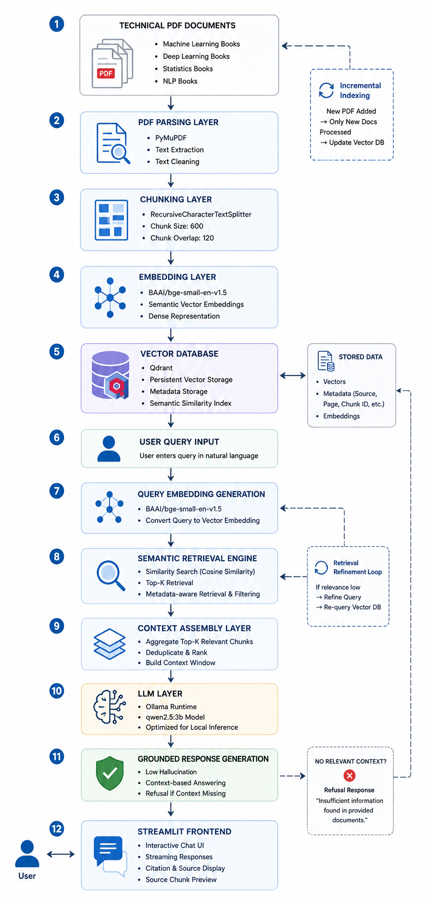

# Enterprise RAG System for Technical Knowledge Retrieval

## Advanced Retrieval-Augmented Generation (RAG) Platform for Technical PDF Intelligence

Production-grade enterprise RAG system designed for intelligent retrieval and grounded response generation from highly technical documents including Machine Learning, Deep Learning, Statistics, Computer Vision, mathematical equations, and code-heavy PDFs.

---

# Overview

This project is a fully local, enterprise-oriented Retrieval-Augmented Generation (RAG) system engineered for technical knowledge retrieval from complex PDF documents.

The system processes highly technical documents containing:

- Machine Learning concepts
- Deep Learning architectures
- Mathematical equations
- Statistical formulas
- Python code snippets
- Technical explanations
- AI/ML engineering concepts
- Computer Vision workflows

The architecture focuses on:

- grounded AI generation
- low hallucination response generation
- semantic retrieval
- scalable vector search
- enterprise retrieval pipelines
- local-first deployment
- CPU-efficient inference
- metadata-aware document understanding

Unlike generic chatbot systems, this platform strictly answers from retrieved context. If relevant context is unavailable, the system refuses unsupported generation to maintain response reliability.

---

# Enterprise Objectives

| Objective | Description |
|---|---|
| Grounded Generation | Ensure responses are generated only from retrieved context |
| Low Hallucination | Prevent unsupported AI-generated information |
| Enterprise Retrieval | Build scalable vector retrieval architecture |
| Local Deployment | Enable fully offline execution |
| Lightweight Infrastructure | Support CPU-only systems with limited RAM |
| Technical PDF Understanding | Handle equations, formulas, and code-rich documents |
| Modular Architecture | Maintain production-grade scalability |
| Streaming Responses | Improve user interaction experience |
| Persistent Storage | Support long-term vector indexing |

---

# Features

## Core Features

| Feature | Description |
|---|---|
| Semantic Retrieval | Context-aware vector similarity search |
| Vector Embeddings | Dense semantic embeddings using BGE models |
| Persistent Vector Storage | Qdrant-based scalable vector database |
| Incremental Indexing | Add new PDFs without rebuilding database |
| Streaming Token Generation | Real-time response streaming |
| Citation Generation | Source-aware grounded responses |
| Formula Rendering | LaTeX mathematical formula rendering |
| Source Chunk Preview | Transparent retrieval inspection |
| Hallucination Reduction | Strict context-grounded generation |
| Metadata-aware Retrieval | Source/page-aware chunk retrieval |
| Docker Deployment | Containerized infrastructure |
| CPU Optimization | Lightweight inference for local systems |

---

# System Architecture


    --- 

# Project Structure

```bash
enterprise-rag-system/
│
├── app/
│   ├── embeddings/
│   ├── ingestion/
│   ├── retrievers/
│   ├── services/
│   ├── vectorstore/
│   ├── llm/
│   └── utils/
│
├── scripts/
│   ├── index_pdfs.py
│   └── ingest.py
│
├── evaluation/
│   ├── run_evaluation.py
│   └── ragas_eval.py
│
├── data/
│   ├── raw_pdfs/
│   └── processed/
│
├── tests/
│
├── streamlit_app.py
├── requirements.txt
├── Dockerfile
├── docker-compose.yml
└── README.md
```

---

# Technology Stack

| Component | Technology |
|---|---|
| Framework | LangChain |
| Frontend | Streamlit |
| Vector Database | Qdrant |
| LLM Runtime | Ollama |
| LLM | qwen2.5:3b |
| Embedding Model | BAAI/bge-small-en-v1.5 |
| PDF Parsing | PyMuPDF |
| Chunking | RecursiveCharacterTextSplitter |
| Containerization | Docker |
| Language | Python |

---

# Why This Architecture

This architecture was intentionally designed for:

- local execution
- low hardware dependency
- enterprise modularity
- retrieval scalability
- maintainable AI engineering workflows

The system separates:

- ingestion
- embeddings
- retrieval
- generation
- frontend serving

This modular design enables future enterprise scaling without major rewrites.

---

# Model Selection Reasoning

## Why Lightweight Models Were Selected

This project was intentionally optimized for:

- CPU-only execution
- 16 GB RAM laptops
- local deployment environments
- reduced inference cost
- fast experimentation

Large models were intentionally avoided because:

| Problem with Large Models | Impact |
|---|---|
| High VRAM requirement | Cannot run locally |
| Slow inference | Poor UX |
| Expensive deployment | High infrastructure cost |
| Large latency | Weak real-time interaction |
| Complex scaling | Difficult local testing |

---

# Embedding Model Analysis

## Selected Model

```text
BAAI/bge-small-en-v1.5
```

## Why This Model

| Criteria | Reason |
|---|---|
| Lightweight | CPU-friendly |
| High Retrieval Quality | Strong semantic embeddings |
| Fast Embedding Speed | Efficient indexing |
| Open-source | Fully local |
| Enterprise Compatible | Excellent RAG performance |

---

# LLM Selection Analysis

## Selected LLM

```text
qwen2.5:3b
```

## Why qwen2.5:3b

| Benefit | Explanation |
|---|---|
| Lightweight | Runs on CPU |
| Strong Reasoning | Good technical understanding |
| Efficient | Low latency |
| Local Deployment | No API dependency |
| Stable Responses | Good grounded generation |

---

# Better Models (If Hardware Constraints Are Removed)

## Open-Source Recommendations

| Model | Recommended Hardware |
|---|---|
| Qwen2.5:14B | RTX 4090 |
| DeepSeek-R1 | Multi-GPU |
| Llama 3 70B | Enterprise GPU Cluster |
| Mixtral 8x7B | High VRAM Systems |

## Enterprise Paid Models

| Model | Use Case |
|---|---|
| GPT-4.1 | Enterprise reasoning |
| Claude Opus | Long-context reasoning |
| Gemini 2.5 Pro | Multi-modal AI |
| Cohere Command R+ | Enterprise RAG |

---

# Vector Database Analysis

## Why Qdrant

| Feature | Benefit |
|---|---|
| Fast Vector Search | Low-latency retrieval |
| Persistent Storage | Durable indexing |
| Metadata Filtering | Advanced retrieval |
| Docker Friendly | Easy deployment |
| Scalable | Production-ready |

---

# Retrieval Pipeline

```text
User Query
    ↓
Query Embedding
    ↓
Semantic Vector Search
    ↓
Top-K Chunk Retrieval
    ↓
Context Assembly
    ↓
Grounded Prompt Generation
    ↓
LLM Response
    ↓
Streaming Output + Citations
```

---

# Chunking Strategy

Current chunking uses:

```python
RecursiveCharacterTextSplitter
```

Configured for:

- semantic continuity
- overlap preservation
- formula-safe splitting
- code-block preservation

Future upgrades include:

- semantic chunking
- adaptive chunking
- structure-aware chunking

---

# Formula Rendering

The system supports:

- LaTeX rendering
- mathematical equations
- statistical formulas
- AI/ML notation

Useful for:

- research documents
- technical books
- mathematical PDFs

---

# Streaming Responses

Streaming generation improves:

- response interactivity
- perceived latency
- user experience
- conversational flow

The frontend streams tokens progressively from Ollama.

---

# Incremental Indexing

The ingestion pipeline supports:

- new document insertion
- partial indexing
- persistent vector updates
- scalable document expansion

No need to rebuild the entire vector database for every update.

---

# Hallucination Reduction

| Technique | Purpose |
|---|---|
| Context Grounding | Prevent unsupported answers |
| Strict Prompting | Reduce fabricated content |
| Retrieval-only Answers | Force source grounding |
| Citation Display | Improve transparency |
| Refusal Logic | Reject unsupported questions |

---

# Local Setup Guide

## Clone Repository

```bash
git clone https://github.com/YOUR_GITHUB_USERNAME/enterprise-rag-system.git

cd enterprise-rag-system
```

---

## Create Virtual Environment

### Windows

```bash
python -m venv venv

venv\Scripts\activate
```

### Linux / Mac

```bash
python3 -m venv venv

source venv/bin/activate
```

---

## Install Dependencies

```bash
pip install -r requirements.txt
```

---

# Ollama Setup

## Install Ollama

https://ollama.com

---

## Pull LLM

```bash
ollama pull qwen2.5:3b
```

---

## Run Ollama

```bash
ollama serve
```

---

# Docker Setup

## Start Qdrant

```bash
docker run -d \
  --name qdrant \
  -p 6333:6333 \
  -p 6334:6334 \
  qdrant/qdrant
```

---

# Environment Setup

Create `.env`

```env
QDRANT_HOST=localhost
QDRANT_PORT=6333

OLLAMA_BASE_URL=http://localhost:11434
OLLAMA_MODEL=qwen2.5:3b
```

---

# Running the Application

## Index PDFs

```bash
python -m scripts.index_pdfs
```

---

## Run Streamlit App

```bash
streamlit run streamlit_app.py
```

---

# Example Workflow

```text
1. Add technical PDFs
2. Run ingestion pipeline
3. Generate embeddings
4. Store vectors in Qdrant
5. Ask technical questions
6. Retrieve relevant chunks
7. Generate grounded response
8. Display citations and formulas
```

---

# Current Limitations

| Limitation | Description |
|---|---|
| CPU Inference | Slower than GPU |
| Small LLM | Limited reasoning depth |
| Fixed Chunking | Not fully semantic |
| No Hybrid Search | Vector-only retrieval |
| Single-node Deployment | No distributed scaling |

---

# Enterprise Upgrade Recommendations

| Upgrade | Benefit |
|---|---|
| Hybrid Search | Better recall |
| BM25 Retrieval | Keyword matching |
| Reranking | Higher precision |
| Query Rewriting | Better retrieval quality |
| Multi-query Retrieval | Improved context coverage |

---

# Future Improvements

- Hybrid Search
- BM25 Retrieval
- Cross-Encoder Reranking
- Query Rewriting
- Multi-Query Retrieval
- Agentic RAG
- Graph RAG
- Semantic Caching
- Multi-modal RAG
- Distributed Retrieval
- Kubernetes Deployment
- FastAPI Microservices
- Redis Integration
- CI/CD Pipelines
- Observability Dashboards
- RAGAS Monitoring

---

# Performance Optimization Ideas

| Optimization | Expected Benefit |
|---|---|
| Semantic Chunking | Better retrieval precision |
| Metadata Filtering | Faster retrieval |
| Quantized Models | Lower memory usage |
| Batch Embedding | Faster indexing |
| Async Streaming | Better UX |
| Vector Compression | Reduced storage |

---

# Engineering Perspective

This project demonstrates:

- enterprise AI architecture
- production RAG engineering
- vector database integration
- local LLM orchestration
- retrieval optimization
- AI systems engineering
- scalable document intelligence

The focus was not merely building a chatbot, but engineering a reliable, grounded AI retrieval platform suitable for enterprise knowledge systems.

---

# Author

**Meher Langote**

AI Engineer | Machine Learning Engineer | RAG Systems Developer

GitHub:

```text
https://github.com/meherlangote
```

---

# License

This project is licensed under the MIT License.

---

# Final Notes

This repository represents a production-oriented approach toward Retrieval-Augmented Generation systems using open-source AI infrastructure.

The project prioritizes:

- grounded AI generation
- enterprise retrieval architecture
- scalable semantic search
- local-first AI systems
- efficient hardware utilization

This system serves as both:

- an enterprise AI engineering portfolio project
- a foundational architecture for scalable production RAG systems

Future iterations will focus on:

- semantic retrieval optimization
- multi-modal intelligence
- distributed AI infrastructure
- enterprise-scale deployment
- advanced retrieval orchestration